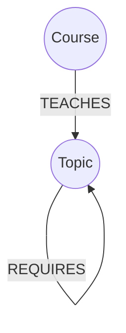

# TechPath — Developer Learning Graph

TechPath is an application that generates dynamic learning paths for software developers. You select a goal (e.g., "AWS", "CI/CD"), and the application calculates the complete sequence of prerequisite topics you need to learn to reach that goal.

**Live Demo**: [https://wexa-ai-assignment-drab.vercel.app](https://wexa-ai-assignment-drab.vercel.app)

*(Please add your screen recording link here)*

## Why a graph database?

Learning paths are fundamentally graphs: skills have prerequisites (`REQUIRES`) that can span multiple levels deep. 

In a relational database, finding all prerequisites for a topic like "Docker" would require complex recursive Common Table Expressions (CTEs) or multiple consecutive queries, which scale poorly and are difficult to maintain. 

A graph database genuinely earns its place here because relationship traversal is a first-class citizen. Finding a learning path is as simple as asking the database to traverse the `[:REQUIRES*]` relationship of arbitrary depth. This natively models how human knowledge builds upon itself.

## Data Model



- **Topic**: Represents a subject to learn (e.g., "JavaScript", "AWS"). Has properties: `name`, `category`, `difficulty`, `description`.
- **Course**: Represents a learning resource. Has properties: `title`, `provider`, `url`.

## Main Queries

### Generating the Learning Path (Multi-hop Traversal)
This is the core query of the application. It finds the goal topic, and then traverses backwards through all `REQUIRES` relationships at *any* depth (`*0..`). We order by the depth of the dependency tree so that the furthest foundational prerequisites are learned first.

```cypher
MATCH p = (goal:Topic {name: $goalTopic})-[:REQUIRES*0..]->(prereq:Topic)
WITH prereq, length(p) AS depth
ORDER BY depth DESC
RETURN prereq { .*, distance: depth } AS node
```

### Fetching Topic Details & Recommended Courses
This query fetches a specific topic and finds all associated courses using the `TEACHES` relationship.

```cypher
MATCH (c:Course)-[:TEACHES]->(t:Topic {name: $topicName})
RETURN c
```

## Setup and Run Instructions

### 1. Database Setup
1. Go to [console.cognodb.com](https://console.cognodb.com/signup) and create a free account.
2. Create a free (c0) instance in your preferred region.
3. Save the connection URI (e.g., `bolt+ssc://<instance-id>.databases.cognodb.com`) and the generated password.

### 2. Local Environment
1. Clone the repository and run `npm install` in the root directory.
2. Create a `.env` file in the root directory based on `.env copy.example`:
```env
NEO4J_URI=bolt+ssc://<your-instance>.databases.cognodb.com
NEO4J_USERNAME=cognodb
NEO4J_PASSWORD=<your-password>
PORT=5001
```

### 3. Seed the Database
Run the seed script to populate the database with topics, courses, and relationships:
```bash
node backend/scripts/seed.js
```

### 4. Run the Application
Run the frontend and backend concurrently:
```bash
npm run dev
# In a separate terminal:
npm run dev --prefix backend
```
The React frontend will be available at `http://localhost:5173`.

## Screenshots
*(Please embed screenshots of the UI here)*
